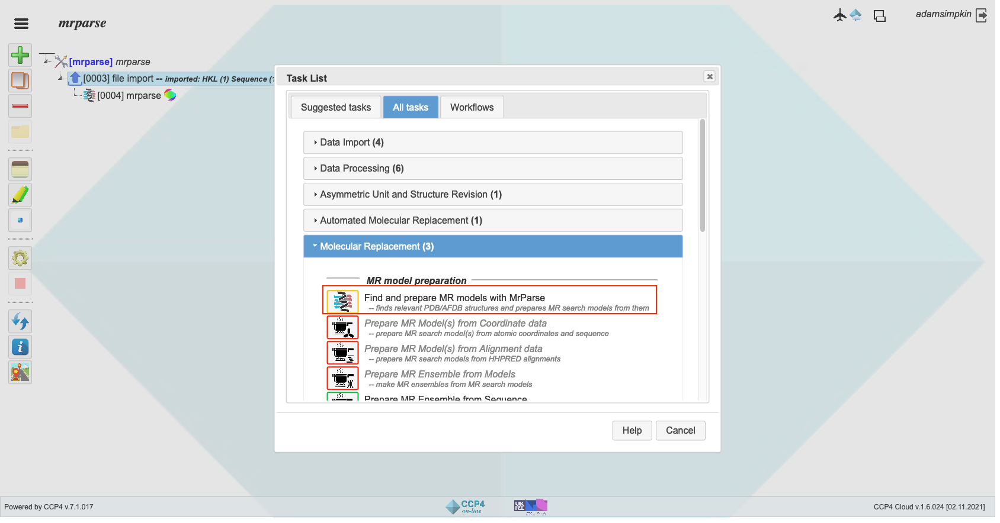
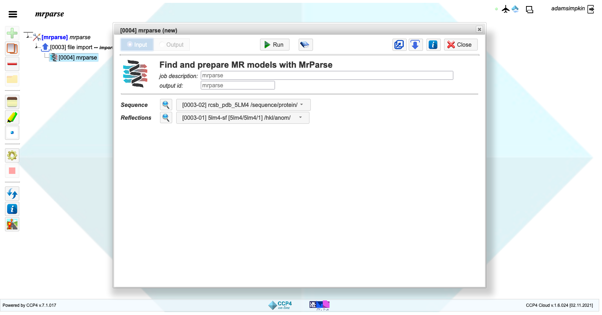
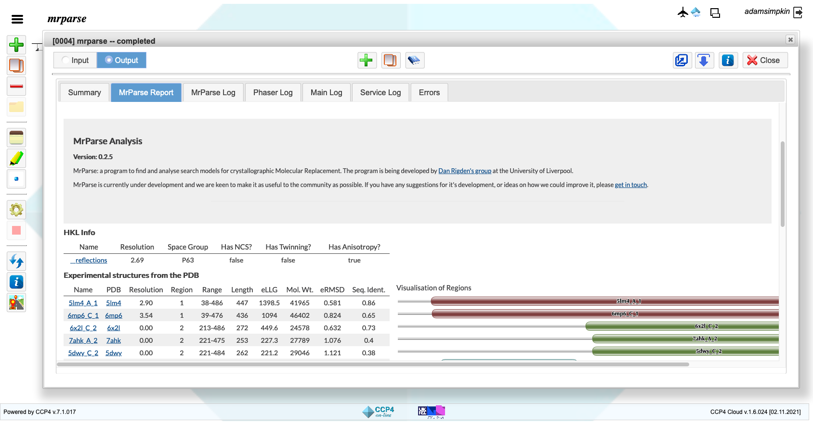

.. _ccp4cloud_script_phmmer:

Performing an MrParse search in CCP4 Cloud using Phmmer
-------------------------------------------------------

A straightforward approach to running MrParse is through CCP4 Cloud.

Input
+++++

After uploading your input data, MrParse can be found under the 'Molecular Replacement' menu in the CCP4 Cloud:

Opening MrParse will bring you to the following menu:

The data you uploaded in the 'file import' step will automatically be entered into the MrParse task. To run MrParse, all you require is a sequence file.
If a reflection file is provided, MrParse will also calculate the eLLG for each of the hits identified by Phmmer.
eLLG has been shown to be a better identifier of whether a search model will work in MR than sequence identity and so we recommend providing a reflection file if one is available to you.
MrParse will also attempt to classify the sequence according to it's secondary structure and whether any regions are predicted to be coiled-coil or transmembrane.

Output
++++++

When MrParse finished running, an results page will appear up showing the results of the search:

A clearer look at the MrParse report page shows the different sections highlighted in different colours:

.. figure:: ../images/mrparse_results.png
   :width: 50%
   :align: center

* In red is information on the input reflection file, including resolution, space group and crystal pathology.
* In teal is information about the PDB entries identified by Phmmer and visualisations of the matches.
* In purple is the protein classification report. This includes a secondary structure prediction, a coiled-coil prediction, and a transmembrane prediction.
* In blue is information about the AlphaFold models identified by Phmmer and visualisations of the matches coloured by pLDDT on an orange to blue scale, where orange indicates very low confidence in the model and blue indicates very high confidence in the model.

