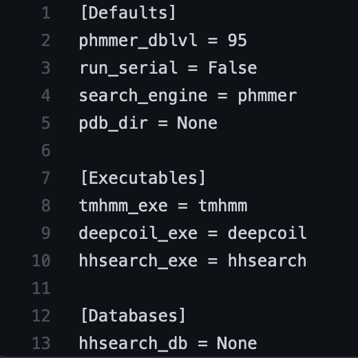

.. _installation:

Installation of MrParse
=======================

MrParse is distributed with the `CCP4 <http://www.ccp4.ac.uk>`_  software suite, however to get the most out of MrParse you may wish to install some additional software.

Additional Software
+++++++++++++++++++

MrParse attempts to classify the sequence according to its secondary structure and whether any regions are expected to be Coiled-coil or Transmembrane.

For the coiled-coil and transmembrane classification we need to install the following software:

* Deepcoil
* TMHMM

By default MrParse performs a PDB search using `PHMMER <http://hmmer.org/>`_ (distributed with CCP4). However, if installed you can also use `HHSEARCH <https://github.com/soedinglab/hh-suite>`_.

Deepcoil
++++++++

DeepCoil requires ``python>=3.6.1`` and ``pip>=19.0`` for installation. The most simple way to install Deepcoil is with ``pip``:

.. code-block:: bash

   pip3 install deepcoil

Full installation instructions can be found on the `Deepcoil Github page <https://github.com/labstructbioinf/DeepCoil>`_.

TMHMM
+++++

TMHMM supports ``python>=3.5``. The most simple way to install TMHMM is with ``pip``:

.. code-block:: bash

   pip install tmhmm.py

Full installation instructions can be found on the `TMHMM Github page <https://github.com/dansondergaard/tmhmm.py>`_.

.. note::

   The GitHub page says TMHMM is only supported on Linux, but we have also be able to run it on MacOS.

HHSEARCH
++++++++

HHSEARCH can be installed with HH-suite3. The simplest way to install HH-suite3 is via ``conda`` or ``docker``:

.. code-block:: bash

   # install via conda
   conda install -c conda-forge -c bioconda hhsuite

   # install via docker
   docker pull soedinglab/hh-suite

Full installation instructions can be found on the `HH-suite Github page <https://github.com/soedinglab/hh-suite>`_.

.. note::

   You will also need to download a database for HHSEARCH, available `here <http://wwwuser.gwdg.de/~compbiol/data/hhsuite/databases/hhsuite_dbs/>`_.
   We recommend installing the latest version of the PDB70.

.. note::

   To use HHSEARCH with MrParse we must update the BioPython installation shipped with CCP4, this can be done with the following command:

   .. code-block:: bash

      ccp4-python -m pip install --upgrade biopython==1.76

Config file
+++++++++++

MrParse ships with a configuration file (``$CCP4/share/mrparse/data/mrparse.config``) that can be modified to ensure all executables and databases are found.

By default, MrParse expects the TMHMM, Deepcoil and HHSEARCH to be callable from the command line as ``tmhmm``, ``deepcoil`` and ``hhsearch`` respectively.

If ``--tmhmm_exe``, ``--deepcoil_exe``, ``--hhsearch_exe`` and/or ``--hhsearch_db`` flags are used, the configuration file will automatically be updated and the flags will not be required for future runs.
If you wish to change the default search engine, the configuration file can be directly altered.